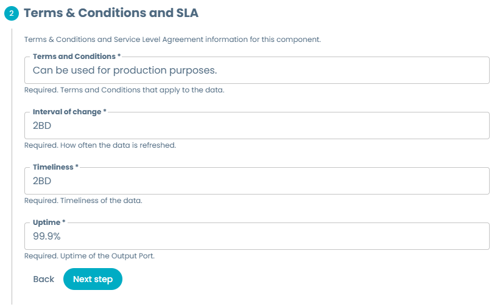
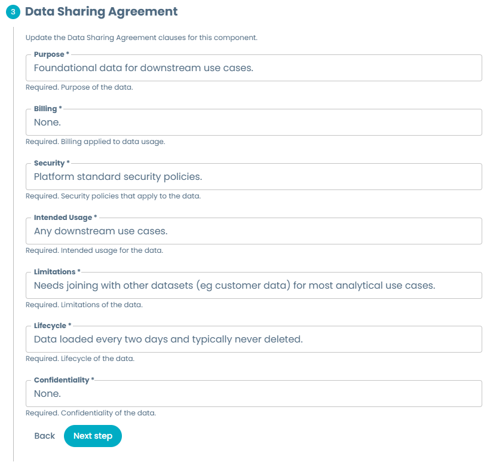
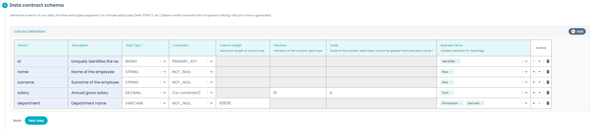

# Full Experience Base Output Port

Output ports are one of the main components for the Data Mesh data platform taxonomy. They allow exposing the Data Product information to users using a well annotated and structured port, as well as handling access control.

This example shows to its fullest extent the expected values for an Output Port, and although it's a full working example, we strongly recommend using a more [streamlined experience](../StreamlinedExperience/streamlinedExperience.md) on creating Output Ports, as it leads to a better user experience as explained on the [Template creation guidelines](../../../../guidelines.md). However, we propose this example to show how a complete Output Port template might look like (for example, to create the edit templates used on the Editor Wizard).

All examples shown here are taken from the accompanying [`base_full_experience.yaml`](base_full_experience.yaml) template file, which you can see live by following the steps explained [here](../../../README.md#usage).

You can see real life examples of this type of Output Port template on our [Witboost Starter Kit](https://github.com/agile-lab-dev/witboost-starter-kit):

- [Snowflake Output Port](https://github.com/agile-lab-dev/witboost-snowflake-output-port-template)
- [Hasura Output Port](https://github.com/agile-lab-dev/witboost-hasura-output-port-template)
- [CDP S3 Datalake Output Port](https://github.com/agile-lab-dev/witboost-cdp-dl-s3-output-port-template/blob/master/template.yaml)
- [CDP CDW Impala Output Port](https://github.com/agile-lab-dev/witboost-cdp-cdw-impala-output-port-template)

## Usage

You can use this folder as the base for a template repository and start developing your own Output Port template, as it has the expected structure. Just ensure to rename the example yaml to `template.yaml` and the edit template example yaml to `edit-template.yaml` and to modify all the necessary fields and identifiers like

- Set the template metadata information, description and default values, the `useCaseTemplateId` and the `infrastructureTemplateId` in both `template.yaml` and `edit-template.yaml` files according to the component you're creating.
- Replace all the placeholders present in the `template.yaml` and the `skeleton/catalog-info.yaml` according to the component and environment you're creating. Placeholders are written between angled brackets (e.g. `<PLACEHOLDER>`)
- Add the appropriate README and documentation for both your template and the generated skeleton
- Modifying the repository destination URL, check [Repository location](#repository-location) for more details.

## Template sections

### Component metadata

You might already be familiar with this section, as it is relatively stable across different kinds of components. To learn more about these fields, check the [Component Metadata](../../ComponentMetadata/componentMetadata.md) example.

### Terms & Conditions and SLA

As part of the data contract of an output port, we must define the requirements and guarantees that this output port should have. This is important for both the producer and the consumer of this output port. By setting terms and conditions, we as producers make explicit the way we require this data to be consumed and handled; while by exposing SLAs, we set the guarantees that we promise the output port will provide to consumers and that we should tend for in order to make consumers happy and our service reliable.

These values will be stored as part of the Output Port data contract and will be shown on the Marketplace once the data product has been successfully deployed.

### Data Sharing Agreement

As part of the output port metadata, we should expose Data Sharing Agreement clauses for this Output Port. We should include aspects like:

- Purpose: Purpose of the data.
- Billing: Billing applied to data usage, ie how consumers are charged (if they are).
- Security: Security policies that apply to the data.
- Intended Usage: Intended usage for the data.
- Limitations: Limitations of the data.
- Lifecycle: Lifecycle of the data.
- Confidentiality: Confidentiality of the data.

### Data contract schema

We propose to leverage the [Table Schema Layout](../../../TableSchemaLayout/tableSchemaLayout.md) example to define a table that the user can employ to define the schema of the data exposed by this Output Port. This follows the OpenMetadata table schema in order to have a consistent and coherent schema across all the components.

### Provide Output port deployment information

This section, and the further sections when needed, are focused on the minimal set of necessary values or default values that the Output Port requires at creation time.

Customize this section and further sections based on the requirements for the specific technology you're using. Follow the best practices guidelines to understand which fields you should or should not add. 

### Repository location

See the [Streamlined Experience](../StreamlinedExperience/streamlinedExperience.md#repository-location) for more information on how we calculate repository URLs to avoid asking the user this information.
