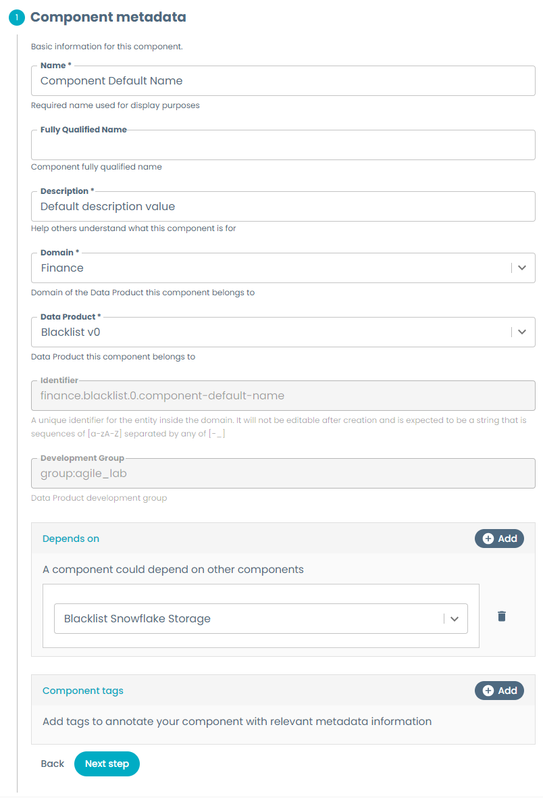

# Component Metadata

When creating any component using templates, some information is always required as it specifies the component base metadata, including name, description, identifiers and relations with other entities in the platform (e.g. mark a component as part of a Data Product). These values are necessary as they ensure the newly created entity is compliant with the platform and can be used within it.

## Usage

You can use the provided [`component_metadata.yaml`](component_metadata.yaml) as the base for a template repository and start developing your own component template; or you can use the other full examples for [Storage Areas](../BaseStorage/baseStorage.md), [Workloads](../BaseWorkload/baseWorkload.md), or [Output Ports](../BaseOutputPort/StreamlinedExperience/streamlinedExperience.md) as they contain the complete structure of a functional template. In case you want to start from this example, just ensure to rename the example yaml to `template.yaml` and the edit template example yaml to `edit-template.yaml`, and to modify all the necessary fields and identifiers like:

- Set the template metadata information, descriptions and default values according to the component you're creating. Placeholders are written between angled brackets (e.g. `<PLACEHOLDER>`)
- Add the template, publish and register steps. You can take them from any of the other full example templates.
- Define your `skeleton/catalog-info.yaml` based on the component catalog-info specification and setting up the `specific` field according to the component and environment you're creating.

## Template section

- Name, fully qualified name and description are three fields needed to define your component and make it understandable to a human user. The `name` field uses an **EntityNamePicker**, which adds the following restrictions on the values you can input:
    - The name must start and end with an alphanumeric character
    - It must contain only alphanumeric characters, hyphens, underscores, and periods
    - It must have a maximum length of 63 characters.
- Domain and Data Product are configured as **EntityPicker** which query the catalog for the existent domains and data products in Witboost (for more information see [Dynamic Select](../../DynamicSelect/dynamicSelect.md)). If you specify a domain, only the data products belonging to that domain will be shown. These fields will determine which data product your component will be a part of, and will be used to define the **Identifier** of this component, which will uniquely identify the component in the Witboost catalog.
- The Development Group will be picked from the chosen data product and conceptually defines that its members will have access to the resources created by said component. This behaviour should be handled accordingly by the component's registered Tech Adapter.
- The Depends On field lets you choose a list of components belonging to the same Data Product that this component is dependent and as such should be deployed before this one. This is used by the platform to build the DAG for the deployment of a Data Product.
- Component tags allows you to add tags to this newly created component.

The template section looks something like this:

## Validation

Since this section is vital for defining a component, there are default validations like checking if the ID of the component already exists. In order to achieve the best user experience, you need to define `name`, `domain`, `identifier` and `dataproduct` in the same page of the template.