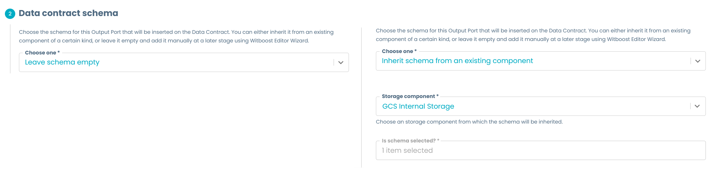

# Streamlined Experience Base Output Port

Output ports are one of the main components for the Data Mesh data platform taxonomy. They are used to expose data to users using a well annotated and structured port, as well as handling access control.

For this reason, is important to streamline the experience of the creation of these output ports to users. This example follows a basic template for an output port creation that includes just the minimal set of values required for the creation of an Output Port, following the guidelines provided on the [Template creation guidelines](../../../guidelines.md). Following this, we don't expect it to be ready to release and deploy right after creating it, but simply allowing a starting point for the data product developers to keep iterating on it until it's ready for deployment. Because of this, it relies heavily on taking advantage of the [Editor Wizard](../../../guidelines.md#edit-wizard).

For a more complete example on how an Output Port template might look like (for example, to create the edit templates used on the Editor Wizard), you might take a look at the [Full Experience Output Port](../FullExperience/base_full_experience.md) example.

All examples shown here are taken from the accompanying [`base_streamlined_experience.yaml`](base_streamlined_experience.yaml) template file, which you can see live by following the steps explained [here](../../README.md#usage).

## Usage

You can use this folder as the base for a template repository and start developing your own Output Port template, as it has the expected structure. Just ensure to rename the example yaml to `template.yaml` and the edit template example yaml to `edit-template.yaml` and to modify all the necessary fields and identifiers like

- Set the template metadata information, description and default values, the `useCaseTemplateId` and the `infrastructureTemplateId` in both `template.yaml` and `edit-template.yaml` files according to the component you're creating.
- Replace all the placeholders present in the `template.yaml` and the `skeleton/catalog-info.yaml` according to the component and environment you're creating. Placeholders are written between angled brackets (e.g. `<PLACEHOLDER>`)
- Add the appropriate README and documentation for both your template and the generated skeleton
- Modifying the repository destination URL, check [Repository location](#repository-location) for more details.

## Template sections

### Component metadata

You might already be familiar with this section, as it is relatively stable across different kinds of components. You might see small differences, like the lack of the Tags field which we judge to belong more appropriately in the Editor Wizard for a minimal information example. To learn more about these fields, check the [Component Metadata](../../ComponentMetadata/component_metadata.yaml) example.

### Data contract schema

Usually, the schema for the information to be exposed is not completely known at creation time; or it might simply be equal to one already defined elsewhere in the Data Product (for example for an Output Port based on a view that preserves the schema of a storage table but just performs selection operations), and as such it might be cumbersome to repeat the process of inserting all over again.

Following this reasoning, we consider the best practice to propose the user the choice between initially leaving the schema empty or to have an inheritance mechanism to retrieve the schema from another component already present in the Data Product.

If you consider that this mechanism might not be necessary for the Output Port template you're developing, you can eliminate this step completely and default the `dataContract.schema` on your `catalog-info.yaml` to an empty array `[]`, providing the possibility to edit it on the Editor Wizard with a schema like the one proposed on the [Table Schema Layout](../../TableSchemaLayout/table_schema_layout.md) example.

To achieve this inheritance feature, we can leverage the [Conditional Fields](../../ConditionalFields/conditional_fields.md) feature and the [Retrieve Data](../../RetrieveData/retrieve_data.md) feature, where the combination between an EntityRelationsPicker and an EntitySelectionPicker gives the possibility to pick the schema of an existing component.

```yaml
properties:
  inheritSchema:
    title: Choose one
    type: boolean
    ui:widget: select
    default: false
    oneOf:
      - const: true
        title: Inherit schema from an existing component
      - const: false
        title: Leave schema empty
dependencies:
  inheritSchema:
    oneOf:
      - properties:
          inheritSchema:
            const: false
      - required:
          - schemaDefinition
        properties:
          inheritSchema:
            const: true
          schemaDefinition:
            ui:options:
              displayTitle: false
            type: object
            required:
              - inheritSchemaComponent
              - schemaColumns
            properties:
              inheritSchemaComponent:
                title: Storage component
                type: string
                description: Choose an storage component from which the schema will be inherited.
                ui:field: EntityRelationsPicker
                ui:filters:
                  - key: spec.type
                    value: storage # You can remove it or modify it in order to choose all or a different kind of components
                ui:fieldName: dataproduct
                relation: hasPart
              schemaColumns:
                title: Is schema selected?
                ui:field: EntitySelectionPicker
                ui:fieldName: schemaDefinition.inheritSchemaComponent
                ui:property: spec.mesh.specific.tableSchema # Modify it based on where the schema is located on your source entity 
```



The key aspect that unlocks this feature is to have a consistent schema specification of the objects used on your templates (in this case, the table schema), so that we can reuse them across components' descriptors. The schema to be inherited should have the same structure as the one needed on the new component. For example, the output port specification uses the OpenMetadata specification on every instance of a table schema, so we recommend sticking to it.

To make the previous snippet work in your context, the main aspect to modify is the `ui:property` value on the `schemaDefinition.schemaColumns` property to make it point to the appropriate path on the target type of component where the schema is located. In the given example we assume that the table schema is located in the `specific` section of the component. If setup successfully, you can now use this inherited schema on the `catalog-info.yaml`, traversing it as a normal object.

If you have a list of schemas to pick from instead of just one, you can improve this section by using a DescriptorPicker instead of an EntitySelectionPicker, in order to allow the user to select the schema to be inherited. Check [Dynamic Select](../../DynamicSelect/dynamic_select.md) for an example on how to do it.

Lastly, when developing the `edit-template.yaml` in order to allow the user to modify this inherited schema, you just need to define the same `schemaDefinition.schemaColumns` property but with the Table Schema Layout instead. The template will retrieve the stored schema and will show it to the user in the table shape. The structure of the object holding these fields must be equal to the structure of the schema retrieved at inheritance time to render correctly all the values. You can see a working example in the [edit template](base_streamlined_experience_edit-template.yaml) of this example.

!!! warning
    This inheritance mechanism is simply used to automatically retrieve the schema from another component and save it in the new one. It **does not** link these two components such that if the upstream schema changes the new one will change as well. If the upstream schema changes, you would need to manually edit the new component using the Editor Wizard to update it.


### Provide Output port deployment information

This section, and the further sections when needed, are focused on the minimal set of necessary values or default values that the Output Port requires at creation time. 

Customize this section and further sections based on the requirements for the specific technology you're using. Follow the best practices guidelines to understand which fields you should or should not add. 

### Repository location

Following the [best practice guidelines](../../../guidelines.md), the streamlined creation of the template removes one of the most confusing sections of a template, which asks the user the location to store this component on the Git repository. As Witboost creates the missing subgroups on the chosen location, we can directly provide a location based on the domain/data product/component structure and write it "hardcoded" on the template specification like this:

```yaml
  steps:
    - id: template
      name: Fetch Skeleton + Template
      action: fetch:template
      input:
        url: ./skeleton
        targetPath: '.'
        values:
          # other parameter to values mapping...
          destination: &destination 'gitlab.com?owner=<PUT-HERE-YOUR-GITLAB-WITBOOST-GROUP>%2F${{ parameters.domain | replace(r/domain:| |-/, "") }}%2F${{ parameters.dataproduct.split(".")[1] | replace(r/ |-/g, "") }}&repo=${{ parameters.name.split(" ") | join("") | lower }}'
          # other parameter to values mapping...

    - id: publish
      name: Publish
      action: witboostMeshComponent:publish:gitlab
      input:
        allowedHosts: ['gitlab.com']
        description: 'This is ${{ parameters.name }}'
        repoUrl: *destination
        rootDirectory: '.'
        dataproduct: '${{ parameters.dataproduct }}'
```

The `destination` calculates the target repository URL by using Nunjucks parsing to extract the domain, data product name and component name in order to build the repository URL. This way, a component named `Sales Output Port` which is part of the `Monthly sales` data product in the `marketing` domain, will create its repository under the `my-company-component-group/marketing/monthlysales` subgroup and with name `salesoutputport`.

This examples assumes that you are both creating one repository per entity, rather than using a mono repo approach; and using Gitlab as the git repository. You can modify it if you're using another of the Witboost supported Git repositories.