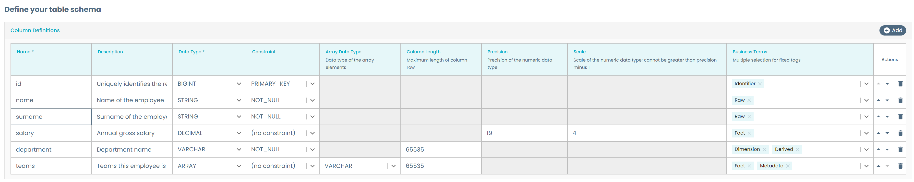

# Base Storage Area

Storage areas are one of the main components for the Data Mesh data platform taxonomy. They allow creating and handling the internal storage systems to manage data the data product needs to work.

This example shows a base template for a Storage, that you can clone and extend based on your technology and environment requirements.

You can see real life examples of this type of Storage templates on our [Witboost Starter Kit](https://github.com/agile-lab-dev/witboost-starter-kit):

- [Snowflake Storage](https://github.com/agile-lab-dev/witboost-snowflake-storage-area-template)

## Usage

You can use this folder as the base for a template repository and start developing your own Storage Area template, as it has the expected structure. Just ensure to rename the example yaml to `template.yaml` and the edit template example yaml to `edit-template.yaml` and to modify all the necessary fields and identifiers like:

- Set the template metadata information, description and default values, the `useCaseTemplateId` and the `infrastructureTemplateId` in both `template.yaml` and `edit-template.yaml` files according to the component you're creating.
- Replace all the placeholders present in the `template.yaml` and the `skeleton/catalog-info.yaml` according to the component and environment you're creating. Placeholders are written between angled brackets (e.g. `<PLACEHOLDER>`)
- Add the appropriate README and documentation for both your template and the generated skeleton
- Modifying the repository destination URL, check [Repository location](#repository-location) for more details.

## Template sections

### Component metadata

You might already be familiar with this section, as it is relatively stable across different kinds of components. To learn more about these fields, check the [Component Metadata](../ComponentMetadata/component_metadata.md) example.

### Storage Area deployment information

This section, and the further sections when needed, are focused on the minimal set of necessary values or default values that the Storage Area requires at creation time.

We provide as an example three fields: Database, schema and table name. Of these, the database and the schema name are not required, and if not provided we calculate a default value based on the data product name and domain. If you check the accompanying `skeleton/catalog-info.yaml`, here is how we calculate this default value:

```yaml



  
# ...
  specific:
    database: 
      
      
      
      
      ${{ finalDatabaseName | upper }}
    schema: 
      
      
      
      
      ${{ finalSchemaName | upper }}
# ...
```

Customize this section and further sections based on the requirements for the specific technology you're using. Follow the best practices guidelines to understand which fields you should or should not add.

### Table schema

We propose to leverage the [Table Schema Layout](../TableSchemaLayout/table_schema_layout.md) example to define a table that the user can employ to define the schema of the table we created on this Storage. This follows the OpenMetadata table schema in order to have a consistent and coherent schema across all the components.



### Repository location

See the [Output Port Streamlined Experience](../BaseOutputPort/StreamlinedExperience/base_streamlined_experience.md#repository-location) for more information on how we calculate repository URLs to avoid asking the user this information.
