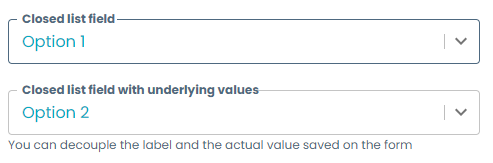
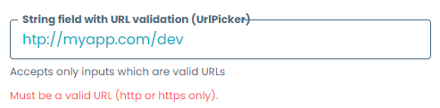

# Form Template Basic Fields

The basic fields are the foundation of any template: whether is a text field to write a component name, or a checkbox to indicate the presence of sensitive information, basic fields provide the easiest way to ask the user information but with the ability to be flexible enough for the different constraints that a form may have.

All examples shown here are taken from the accompanying [`basic_fields.yaml`](basic_fields.yaml) template file, which you can see live by following the steps explained [here](../README.md#usage).

## Text fields

Text fields, also called string fields, provide the user the possibility to write text on a provided textbox. The template creator can customize these fields in order to add validations, style, or to constrain the options that the user can write or select.

You can define a string field like this:

```yaml
basicStringField:
  title: Basic String Field
  type: string
```


As you can see, a text field is simply the base of any field without any extra parameters. 

### Date & Time fields

You can also set up the string fields to act as date and date-time pickers. The stored value will be an ISO8601 date or date-time string.

```yaml
dateTimeField:
  title: Date-time
  type: string
  "format": "date-time"
```


```yaml
dateField:
  title: Date
  type: string
  "format": "date"
```


### Constraining and validating the input

From the basic text field, you can start adding constraints, like changing the `type` to `number` in order to constraint the input to only accept integers. By adding other parameters to the field, it is possible to add extra constraints, like the ones shown below.

For other constraints, check the Witboost documentation and the [react-json schema form documentation](https://rjsf-team.github.io/react-jsonschema-form/docs/).

#### Input length
You can constrain a string length minimum and maximum. (Here we also show how to set the default value for any field):

```yaml
defaultStringField:
  title: Basic String Field + Default + Max Length
  type: string
  default: Default value here
  ui:options:
    minLength: 3
    maxLength: 10
```


#### Integer ranges
It is possible to constraint a number input to set minimum and/or maximum acceptable values. These values are inclusive.

```yaml
constrainedNumberField:
  title: Number field with constraint 0 <= x <= 10
  type: number
  minimum: 0
  maximum: 10
```


#### Closed list of values
Instead of letting the user write the value, you can provide a list of values (enum) that will be rendered as a select widget. You can either set the labels equal to the values, or decouple the two of them.

```yaml
enumField:
  title: Closed list field
  type: string
  enum:
    - Option 1
    - Option 2
    - Option 3
enumNamesField:
  title: Closed list field with underlying values
  type: number
  description: You can decouple the label and the actual value saved on the form
  enum:
    - 1
    - 2
    - 3
  enumNames:
    - Option 1
    - Option 2
    - Option 3
```



#### Email validation
Validates that the user input is a correctly formatted email.

```yaml
emailStringField:
  title: String field with email validation
  type: string
  format: email
```


#### RegEx validation
Validates the user input using a regular expression. This is the first instance of a Witboost Picker, a special kind of field with extra features. You can set the regular expression, the error message to be shown, and any RegEx flags like global `g`, case-insensitive `i`, etc.

```yaml
regexPicker:
  title: String field with RegEx validation (RegexPicker)
  type: string
  ui:field: RegexPicker
  description: Sets a regular expression and validates the input when proceeding to the next section
  # This field can contain the placeholder for the text area in the regex picker
  ui:placeholder: ''
  validation:
    errorMessage: "Error message: This field accepts only the best food"
    regularExpression: ^pizza$
    flags: i
```


#### URL validation
Validates that the user input is a correctly formatted URL.

```yaml
urlPicker:
  title: String field with URL validation (UrlPicker)
  type: string
  description: Accepts only inputs which are valid URLs
  ui:field: UrlPicker
```



#### Filesystem path validation
Validates that the user input is a correctly formatted path from a Linux/macOS or Windows filesystem.

```yaml
fileSystemPicker:
  title: String field with filesystem path validation (PathPicker)
  type: string
  description: Accepts only inputs with are valid filesystem paths, matching Linux/macOS and Windows paths
  ui:field: PathPicker
```


### Styling

The following styling tips are also applicable to most of the more complex fields, like the Witboost Pickers.

#### Disabled field
The field will be shown to the user, but it cannot be edited. It should include a `default` value which will effectively be the value of the field.

```yaml
disabledField:
  title: Disabled field
  type: string
  default: Non-editable value
  ui:disabled: true
```


#### Hidden field
You can hide any type of field, not only basic fields, and its value will still be saved on the form.

```yaml
hiddenField:
  title: Hidden field
  type: string
  default: I am hidden!
  ui:widget: hidden
```

#### Required field
You can set a field as required, by adding it to the `required` property at the top object level:

```yaml
...
required:
  - requiredStringField
properties:
  requiredStringField:
    title: Required field
    type: string
    description: This field will prevent you from going to the next section until filled
...
```


#### Multiline
You can convert a field into a text area by setting `ui:options.multiline` to true and specifying the minimum amount of `rows` to be displayed.

```yaml
multilineField:
  title: Multiline field
  type: string
  description: Text area field
  ui:options:
    multiline: true
    rows: 5
```


#### CSS styling
Some fields allow to pass CSS properties to the field in order to further customize the picker. All the properties inside `ui:style` will override the field style ones.

```yaml
codeStyleField:
  title: Code-like style field
  type: string
  description: Usage of ui:style to give a different look to the field
  ui:options:
    multiline: true
    rows: 5
  ui:style:
    font-family: Consolas
    color: "#111"
```


## Boolean fields

You can create boolean fields which will store a `true` or `false` value. They come in two flavors: checkboxes/radio buttons and select widgets.

!!! warning
    If a `default` is not given, the field will store by default a `null` value, not a `false` value.


- **Checkboxes/Radio buttons**
    ```yaml
    checkboxField:
      title: Checkbox field
      description: Description is not shown
      type: boolean
    radioField:
      title: Radio field
      description: If no default is set, the field will be null unless user checks and unchecks it to make it `false`
      type: boolean
      ui:widget: radio
    ```
  

- **Select**
    ```yaml
    selectField:
      title: Yes/No field
      type: boolean
      ui:widget: select
    selectWithNamesField:
      title: Custom names boolean select field
      type: boolean
      ui:widget: select
      oneOf:
        - const: true
          title: "This is the true option"
        - const: false
          title: "This is the false option"
    ```
    

!!! info
    As of Witboost 1.5.1, we are aware that the boolean select with custom names is currently presenting inconsistent behaviour. An alternative in the meantime would be using the string field with a [closed list of values](#closed-list-of-values).

## Array fields

All the template fields can be rendered as an ordered list by using the `array` type. By defining a field as an array, you can set the children schema as any kind of field shown in the Templates Gallery.

```yaml
stringArray:
  type: array
  title: Free-form string array
  items:
    title: Basic String Field
    type: string
```


You can add new items, delete them and change the order between them using the buttons at the side of each item.

There is a special case of array field which allows to choose several options from a closed list of values and that is rendered in a more natural way.

```yaml
enumStringArray:
  type: array
  title: Enum string array
  uniqueItems: true
  items:
    title: Basic String Field
    type: string
    enum:
      - "Option A"
      - "Option B"
      - "Option C"
```


### Constraining and validating the input

#### Array size

You can constrain the array minimum and maximum size. 

```yaml
constrainedArray:
  type: array
  title: Constrained string array
  minItems: 2
  maxItems: 10
  items:
    title: Basic String Field
    type: string
```


## Object fields

You can group different fields into objects in order to group common information, to add subsections with their own titles and description, to make templates with a richer style and structure, or to enable the DescriptorPicker functionality to retrieve local form values.

Object descriptions, as well as step descriptions, support Markdown syntax to enrich the form visuals. For more information, check the [Layouts](../Layouts/layouts.md#markdown-descriptions) examples.

```yaml
numberFields:
  title: Number fields
  type: object
  description: Number fields are a way to enforce an input to accept only integer values 
  required:
    - numberField
  properties:
    numberField:
      title: Integer field
      type: number
    constrainedNumberField:
      title: Number field with constraint 0 <= x <= 10
      type: number
      minimum: 0
      maximum: 10
```


You can also set required fields on objects, and you must define them at this level if you want to render them mandatory. If you set on the object root level a field as required, but it is contained in an object, it will not be enforced by the platform.

To understand how to add style to these objects in order to make better templates, check the [Layouts](../Layouts/layouts.md) examples.

To understand how to leverage objects to retrieve information from other parts of the form using the DescriptorPicker, check the [Dynamic Select](../DynamicSelect/dynamic_select.md) examples.