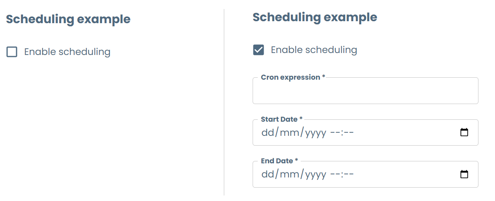

# Conditional fields

When creating templates on Witboost, it is possible to define conditions which allow for different fields or sections to be shown based on user's input. This way, you can configure the template to ask for a different set of values based on a choice made by the user. 

For example, when creating a workload based on a job, it is possible to ask the user whether they want to configure a scheduling setup for said job or to manually trigger it.

All examples shown here are taken from the accompanying [`conditional_fields.yaml`](conditional_fields.yaml) template file, which you can see live by following the steps explained [here](../README.md#usage).

There are two ways to define this conditional template schema.

## allOf

allOf is one of the JSON Schema keywords for [Schema Composition](https://json-schema.org/understanding-json-schema/reference/combining). In the template's context, it means allowing the combination of two or more different template schemas into one, based on the user input. By defining the set of fields to show on each possible input of the user on a certain field, the combination of allOf with an if-then-else structure will match the desired set of fields.

The following example illustrates how to set up the job scheduling scenario:

```yaml
- title: Update Workload job scheduling
  properties:
    enableScheduling:
      type: boolean
      title: Enable scheduling
  allOf:
    - if:
        properties: # We setup the properties values this condition needs to satisfy 
          enableScheduling:
            const: true # Use the `const` keyword to configure the condition value
      then: # All the properties inside the `then` will be shown when the condition is true 
        properties:
          cronExpression:
            title: Cron expression
            type: string
          startDate:
            title: Start Date
            type: string
            format: date-time
          endDate:
            title: End Date
            type: string
            format: date-time
        required:
          - cronExpression
          - startDate
          - endDate
```



This way, the "Cron expression", "Start Date" and "End Date" fields will be shown if and only if the value for "Enable scheduling" is `true`. Note that the `allOf` keyword is at the `properties` level of the parent object, not nested with the other fields. 

We can add more if-then objects to it, ensuring the following aspects:

1. If you add overlapping conditions, all the defined schemas inside true conditions will be shown.
2. You can have the same field in two different conditions, but their type and configuration must be the same. Witboost doesn't allow for the same field to be rendered with different types on different conditions. If not followed, you might not see the condition working correctly, or see only one of the two renders on both conditions. See [Same field, different visual renders](../../templating_solutions.md#same-field-different-visual-renders) for more information.

The following example is a simplified version of the [Table Schema Layout](../TableSchemaLayout/table_schema_layout.md) showing multiple if-then conditions:

```yaml
items:
  type: object
  required:
    - name
    - dataType
  properties:
    name:
      type: string
      title: Name
    dataType:
      type: string
      default: INT
      title: Data Type
      enum:
        - INT
        - STRING
        - VARCHAR
        - CHAR
        - DECIMAL
  allOf:
    - if:
        properties:
          dataType:
            oneOf:
              - const: VARCHAR
              - const: CHAR
      then:
        properties:
          dataLength:
            title: Column Length
            type: integer
            default: 65535
        required:
          - dataLength
    - if:
        properties:
          dataType:
            oneOf:
              - const: DECIMAL
      then:
        properties:
          precision:
            title: Precision
            type: integer
            default: 38
          scale:
            title: Scale
            type: integer
            default: 0
        required:
          - precision
          - scale
```

### `contains` condition

It is possible to set the `if` condition of a conditional field to check for the existence of a value in an array, rather than checking for equality of the field. You can use the `contains` key for this purpose:

```yaml
businessDomain:
  title: Business Domain
  type: object
  properties:
    businessDomainMenu:
      title: Business Domain
      description: Add the business domains that this component impacts 
      uniqueItems: true
      type: array
      items:
        type: string
        enum:
          - Finance
          - Marketing
          - IT
          - Sales
          - Design
          - Other
  allOf:
    - if:
        properties: # We setup the properties values this condition needs to satisfy
          businessDomainMenu:
            contains: # Use the `contains` keyword to check the existence of Other in the specified array
              const: Other
      then: # All the properties inside the `then` will be shown when the condition is true
        properties:
          otherBusinessDomain:
            title: Other Business Domain
            type: string
            description: Fill this with the other business domain this component impacts
        required:
          - otherBusinessDomain
```

This example shows the `otherBusinessDomain` field only if the user has selected "Other" in the above array, allowing the user to write the additional value.

## Schema dependencies + oneOf

The other way to perform conditional is using the `dependencies` keyword of the [React JSON Schema Form](https://rjsf-team.github.io/react-jsonschema-form/docs/json-schema/dependencies/#schema-dependencies) in conjunction with the `oneOf` keyword. 

This works by setting up a set of schemas that explicitly depend on one field, and whenever this fields changes, it will compare to-be merged schemas with the current schema to choose only the one that matches. The key for this approach is to have the field that acts as the condition in both schemas with the appropriate value set on it as `const`. When the user inputs the value, only the matching schema will be selected. 

This is how the job scheduling example is seen in this approach:

```yaml
dependenciesSchedulingExample:
  title: Scheduling Example - Dependencies+oneOf Strategy
  type: object
  properties:
    enableScheduling:
      type: boolean
      title: Enable scheduling
      default: false
  dependencies:
    enableScheduling: # We define the field we depend on
      oneOf:
        - properties:
            enableScheduling:
              const: true # For each item in the `oneOf` array, we put the dependent field with the desired value 
            cronExpression:
              title: Cron expression
              type: string
            startDate:
              title: Start Date
              type: string
              format: date-time
            endDate:
              title: End Date
              type: string
              format: date-time
          required:
            - cronExpression
            - startDate
            - endDate
```

Similarly to the allOf strategy, the `dependencies` keyword is at the `properties` level of the parent object, not nested with the other fields.

You can see the structure being used in the [Streamlined Experience Output Port](../BaseOutputPort/StreamlinedExperience/base_streamlined_experience.md) when defining the component's data contract schema.

## Which one to use?

There is no golden rule on which approach is the best. While the allOf if-then structure is more flexible, it clutters the yaml and makes it a bit difficult to understand, specially when using nested conditions; while the dependencies keyword is simpler but allows for explicit dependencies and cleaner flow.

For simpler conditions that may affect a large chunk of the step fields, it might be best to use the dependencies strategy, while for more refined conditions we recommend using the allOf approach. Whichever method you use, always strive for the best user experience while also guaranteeing maintainability of the template for the future.