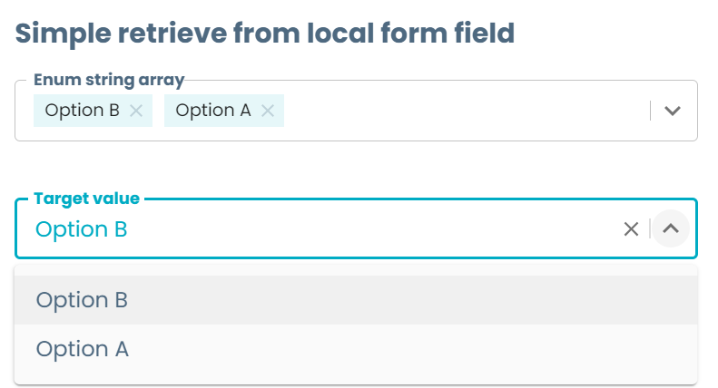
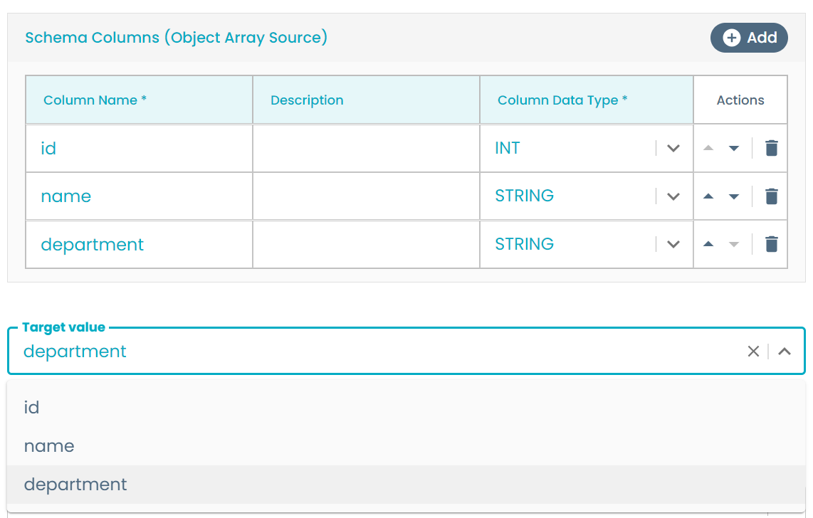
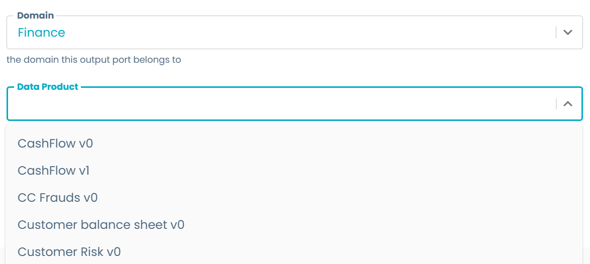
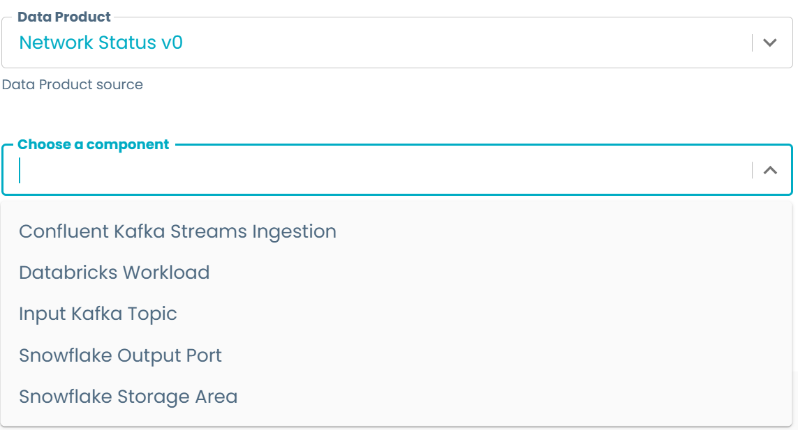
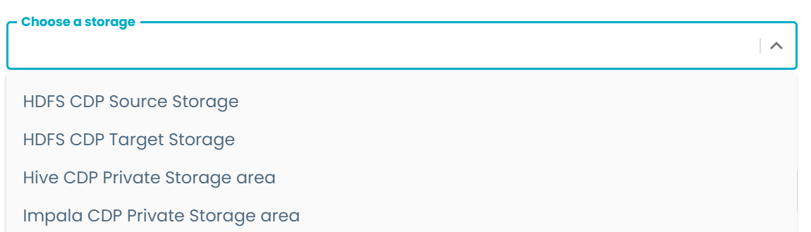
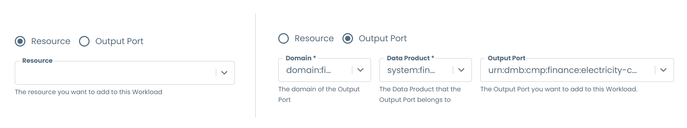
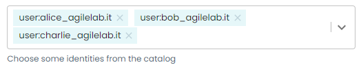
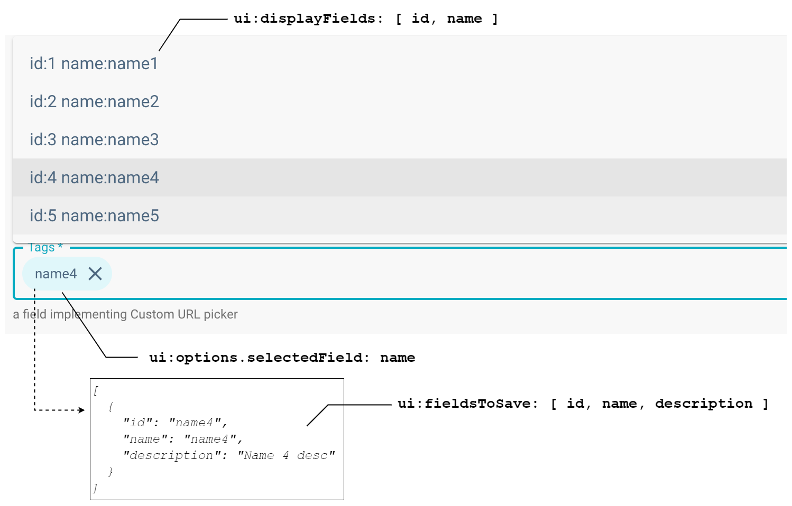

# Dynamic Data Selection

On many cases when building templates, some fields require limiting the options provided to the user based on information from existing sources, like from other entities in Witboost or from the same form. Opposite to what [retrieving single pieces of information](../RetrieveData/retrieveData.md) refer to, we dynamically query information to offer the user a sensible choice based on the context of the new entity being created.

This guide explains how to retrieve sets of values that can be shown to the user to limit the input provided by them, including querying the Witboost catalog, external sources, or picking information from the form itself.

Dynamically retrieving data to display as input is very useful as it allows our forms to do things like:

- Retrieve entities and its metadata to link the new one to them (e.g. data products to domain, components to a data product, users to data products as owners, etc. See for example [Component Metadata](../BaseComponents/ComponentMetadata/componentMetadata.md)).
- Defining dependencies among components of the same system (e.g. inside the same data product).
- Defining lineage relationships between components of different systems (e.g. a workload that reads from the output port of another data product).
- Table partition definition based on inputted table schema.
- Query external business glossaries to retrieve business terms to add to the component 
- and much more...

All examples shown here are taken from the accompanying [`dynamic_select.yaml`](dynamic_select.yaml) template file, which you can see live by following the steps explained [here](../README.md#usage). You might get some validation errors upon opening but these are expected, [see below](#external-source-api) for the reason.

## Local (form) source

Querying a set of options from other array or object fields of the form is possible thanks to the **DescriptorPicker** configured as `sourceType: field`. Despite its name, the DescriptorPicker can query any type of object, not only entity descriptors, including the local form context. The configuration for the most basic example can be seen below.

```yaml
localRetrieve:
  title: Options retrieval from local form field
  type: object
  properties:
    sourceArray:
      type: array
      title: Source array
      uniqueItems: true
      items:
        type: string
        enum:
          - "Option A"
          - "Option B"
          - "Option C"
    targetValue:
      title: Target value
      type: object # It has to always be a `type: object`
      ui:field: DescriptorPicker
      sourceType: field
      source: localRetrieve
      optionsAt: sourceArray
```



As seen on the example, the key aspect is wrapping the desired field in an object to set it as `source` on the DescriptorPicker and setting the desired field on the `optionsAt` field. As the source is a simple string list, with only this configuration, the retrieval will work as expected.

:::info

Whenever you use a **DescriptorPicker**, the output of this field will be an object with three fields: `label`, which stores the display name of the chosen option, `key` which stores the index of the selected object in the list, and `value`, which stores the actual value we're interested in. 
    
Whenever you build your templates and skeleton, be aware of this fact when referencing the output of any DescriptorPicker field. For more information, check the Witboost documentation.

:::

If the source array has a more complex schema, like an object, it is possible to use the `optionsDisplayNameAt` property to pick a field as a display name.

```yaml
localRetrieve:
  title: Options retrieval from local form field
  type: object
  properties:
    sourceObjectArray:
      title: Schema Columns (Object Array Source)
      type: array
      ui:ArrayFieldTemplate: ArrayTableTemplate
      items:
        type: object
        ui:ObjectFieldTemplate: TableRowTemplate
        required: [ name, dataType ]
        properties:
          name:
            type: string
            title: Column Name
          description:
            type: string
            title: Description
          dataType:
            type: string
            default: INT
            title: Column Data Type
            enum:
              - INT
              - DOUBLE
              - DECIMAL
              - TIMESTAMP
              - DATE
              - STRING
              - VARCHAR
              - BOOLEAN
    targetObjectArrayValue:
      title: Target value
      type: object # It has to always be a `type: object`
      ui:field: DescriptorPicker
      sourceType: field
      source: localRetrieve
      optionsAt: sourceObjectArray
      optionsDisplayNameAt: name
```



As an example, this can be useful for choosing the partition columns on a table based on the user inputted table schema.

## Catalog source

The Witboost catalog contains all the entities that make Witboost work, and in many cases it's necessary to retrieve them when working with templates, especially when creating new components that are part of a parent one (e.g. components to data products), or retrieving identities to assign roles or responsibilities to a certain user or group. For these purposes, Witboost offers a comprehensive list of pickers tailored for these use cases, so let's see some usage examples.

:::warning

This sourcing mechanism is simply used to automatically retrieve data from other entities and save it in the new one. It **does not** link them such that if the upstream schema changes the new one will change as well. If the upstream entity changes, you would need to edit the new component using the Editor Wizard to update it.

:::

### Entity types

#### All entities

The base strategy used to query the Witboost catalog is the **EntityPicker**, which retrieves entities from the platform following a set of filters defined on the picker properties. It can filter based on the kind of the entity, and equality matches based on a source field and a value picked from the entity based on a given path.

The following example shows the two main filter types. The `domain` field will query the catalog for all entities with kind Domain, while the `dataproduct` field will query all entities with kind System that also contain the value `spec.domain` equal to the value chosen on the `domain` field:

```yaml
domain:
  title: Domain
  type: string
  description: The domain this component belongs to
  ui:field: EntityPicker
  ui:options:
    allowedKinds:
      - Domain
dataproduct:
  title: Data Product
  type: string
  description: The Data Product this component belongs to
  ui:field: EntityPicker
  ui:filter:
    - fieldName: domain
      entityPath: spec.domain
  ui:options:
    allowedKinds:
      - System
```



If, for example, we have a Finance domain with a list of data products, we can initially pick "Finance" from the first option and then the second field will update its options list accordingly, showing only the data products of the Finance domain. Please notice that if nothing is selected on the `domain` field, the related filter will be ignored and all data products will be shown.

:::info

Currently, for the **EntityPicker** to work, the fields that the applied filters are referencing must be at root level of the form, not nested on other objects, but they can be located on any section of the form.

:::

Currently, it is not possible to use literals as filter values, but you can create a [hidden string field](../BasicFields/basicFields.md#hidden-field) with a default equal to the filter value you need and reference such field on the EntityPicker filter.

```yaml
hiddenDomain:
  type: string
  default: "domain:distribution"
  ui:widget: hidden
filteredDataProduct:
  title: Data Product + Hidden filter
  type: string
  description: Data Product source + Hidden filter
  ui:field: EntityPicker
  ui:filter:
    - fieldName: hiddenDomain
      entityPath: spec.domain
  ui:options:
    allowedKinds:
      - System
```

For more information about the configuration of the EntityPicker, see the Witboost documentation.

##### Identities and principals

A special case that the EntityPicker provides when querying for users and groups allows to provide an extra filter that restricts the options to users or groups that the current user belongs to. This is enabled by setting the property `ui:options.showOnlyUserOwnGroups` to `true`. By enabling this: 
  
- If `allowedKinds` contains User, then it will only show users that belong to the same groups of the current user
- If `allowedKinds` contains Group, then it will only show the groups to which the current user belongs.

```yaml
dataProductOwnerFiltered:
  title: Data Product Owner
  type: string
  description: User who owns the Data Product
  ui:field: EntityPicker
  ui:options:
    showOnlyUserOwnGroups: true
    allowArbitraryValues: false
    allowedKinds:
      - User
```

This is useful for example to set the owner of a data product only to users from the same domain or development group as the current user. For more complex queries on users and groups, see the [Entity relations](#entity-relations) and the [Identities and principals relations](#identities-and-principals-relations) strategies.

#### Entity relations

The second main component of a catalog is the relationships between entities. For example, on a Data Mesh taxonomy, a Data Product has a relationship with its components of type `hasPart`, representing that a data product has several parts which are the components. On the same fashion, there are several types of relations between all the different entities present on the catalog.

Querying the relations themselves is not much useful for template creation, but using these relations we can query a set of entities related to another known entity. For this purpose it is possible to use the **EntityRelationsPicker** which, based on a known entity, a relation and a set of filters, can query a set of entities to show to users. This can be useful for example for:

- Defining dependencies among components of the same system (e.g. inside the same data product).
- Query users belonging to a specific group

As mentioned above, is necessary to have an initial entity from which to query its relations. It is possible to use all the other pickers explained in this document to achieve so. For instance, to get all the components of the same data product, we can do the following:

```yaml
dataproduct:
  title: Data Product
  type: string
  description: Data product source
  ui:field: EntityPicker
  ui:filter:
    - fieldName: domain
      entityPath: spec.domain
  ui:options:
    allowedKinds:
      - System
dataProductComponents:
  title: Choose a component
  type: string
  ui:field: EntityRelationsPicker
  ui:fieldName: dataproduct
  relation: hasPart
```



The EntityRelationsPicker also accepts filters. For example, to retrieve only the storages of a data product, you can do the following:

```yaml
dataProductStorages:
  title: Choose a storage
  type: string
  ui:field: EntityRelationsPicker
  ui:fieldName: dataproduct
  relation: hasPart
  ui:filters:
    - key: spec.type
      value: "storage"
```



:::info

Notice that these filters are different from the EntityPicker `ui:filter`, as these accept literal values rather than a reference to other form fields. This is done on purpose for backward compatibility purposes with the now retired EntityComponentsPicker.

:::

Using the EntityRelationsPicker, it is also possible to grab as source not only an entity referenced on a form field, but a reference to another entity which is stored as a value inside that initial entity using the `ui:property` keyword similarly to the EntitySelectionPicker. This is useful for referencing relations of entities whose IDs are stored inside other entities.

##### Identities and principals relations

We can leverage the `ui:property` to retrieve the user of the owner group of some entity. For example, it is possible to retrieve all users belonging to the group stored as owner group of a domain. In this case, we query the existing domains using an EntityPicker, and then we fetch the users using an EntityRelationsPicker that fetches the chosen domain, grabs the `ownerGroup` value and uses it to retrieve all users belonging to said group. In practice, this looks like the following:

```yaml
domain:
  title: Domain
  type: string
  description: The domain this component belongs to
  ui:field: EntityPicker
  ui:options:
    allowedKinds:
      - Domain
user:
  title: Data Product Owner
  description: Select a member of the domain's owner group as Data Product owner
  type: string
  ui:field: EntityRelationsPicker
  ui:fieldName: domain
  ui:property: spec.owner
  relation: hasMember
  returnFormat: ref
```

Here, we add the `ui:property` to define the field inside the Domain entity where the owner group ID is located (`spec.owner`), and then, by specifying the `hasMember` relation, we retrieve all users belonging to said group, so the template user can now choose from this limited set of people. 

:::info

Currently, for the **EntityRelationsPicker** to work, the field used as a source and set on the `ui:fieldName` must be at root level of the form, not nested on other objects, but they can be located on any section of the form.

:::

For other complex queries on users and groups, see the [Identities and principals relations](#identities-and-principals-relations) strategy.

For more information about the configuration of the EntityRelationsPicker, see the Witboost documentation.

#### Data lineage

Data lineage allows us to see how data flows inside a platform. We can define this "reads from" relationships by using the **ReadsFromPicker** which provides a field from which the user can choose a reads-from source, querying the catalog for available Output ports on a set domain and data product, or by choosing from the set of registered external Resources.

For example, on the Data Mesh taxonomy, workloads are set with a field specifying the list of sources said workloads reads from. These sources can be either output ports from other data products, or external sources. In order to select said source, the **ReadsFromPicker** is used. See [Base Workload](../BaseComponents/BaseWorkload/baseWorkload.md) for an example.

```yaml
readsFromComponent:
  title: Reads-from picker
  type: string
  ui:field: ReadsFromPicker
```



#### Identities and principals

Witboost provides a set of pickers to retrieve directly identities (users, groups or roles) from the Witboost catalog. This is useful not only on component creation templates, but also on Access Request templates, to provide access to a set of users to a given component.

The **IdentitiesPicker** provides a way to select a list of users and/or groups registered on Witboost based on a set of provided filters. This acts as a condensed way to have an array of EntityPickers filtered by User and/or Group kind. Furthermore, it allows to configure the maximum size of the array via the `ui:options.maxIdentities` property, and also to instruct the picker to show only users and groups the logged user is member of via the `ui:options.showOnlyUserMemberGroups`. An example of this can be shown below:

```yaml
identities:
  title: Source entity
  type: array
  description: "Choose some identities from the catalog"
  ui:field: IdentitiesPicker
  ui:options:
    maxIdentities: 5
    allowedKinds:
      - User
    showOnlyUserMemberGroups: true
```



The **RbacRolePicker** provides the functionality to query the set of existing roles on the catalog, useful when creating permissions or assigning them to subjects. Only roles with their `visibility` set to `user` will be shown, so if the field is shown disabled it means that there are no roles that comply with this restriction. 

```yaml
roleId:
  type: string
  title: Role
  ui:field: RbacRolePicker
  default: <optional default role ID>
  ui:options:
    allowArbitraryValues: false
```

Another important picker regarding Access Request templates is the **AccessControlListPicker**. It provides a way to query the users and groups which currently have granted access to an entity. In fact, this picker is useful only on Access Request templates, since at creation time the entity hasn't been created yet and so there is no access list to query. With this picker you can update the grants given to users and groups, allowing you to remove them from the list to be sent to the Update Access Control List (ACL) task.  

### Using the retrieved entity

When using any of the strategies mentioned above to retrieve the desired entities, the field is actually saving the id of the retrieved entity, not the whole object as its value. For example, a certain domain and a data product field will save the strings `domain:finance` and `system:finance.cashflow.1` respectively as values. If you need to actually retrieve specific values stored on the entities, there are two strategies: Either you can use the **EntitySelectionPicker** to perform this information refining to retrieve single pieces of information (See [Retrieve Data](../RetrieveData/retrieveData.md#catalog-source) and [Transforming Entities](../TransformingEntities/transformingEntities.md) for more information), or you can use the **DescriptorPicker** to retrieve a set of values to act as options from said entity descriptor.

The second strategy is limited only to the **EntityPicker** and revolves around the `ui:options.storeRawEntity` property, which allows to inject into the current context the raw object of the entity, enabling the DescriptorPicker to query said object. By setting this property to `true` we can retrieve information similarly to how we query [local form sources](#local-form-source) using this same picker. This is explained in great detail on Witboost documentation so let's see some more complete examples:

- **Retrieving a set of tables from a storage component for the user to choose one:**

Let's assume we have a data product with a storage component that defines a list of internal database tables to be deployed. We then want to create an output port on the same data product that exposes one of this tables as a view, so on the template of the output port we need to somehow retrieve the table information. 

As a first solution, we can make the user write the table name they want to expose by themselves, but this is prone to typing errors and requires a higher cognitive load from the side of the user. 

A second, more robust solution would be to leverage the Descriptor Picker and restricting the user choices to what actually exists in the data product, letting them choose the storage and the table name from a closed set of values retrieved from the entities, without needing to actually write anything. A solution like this would look like:

```yaml
hiddenKind:
  type: string
  default: storage
  ui:widget: hidden
  ui:disabled: true
underlyingStorage:
  title: Storage Area
  type: object
  description: Required. An Output Port has to get data from a Storage Area in the same Data Product.
  ui:field: EntityPicker
  ui:fieldName: dataproduct
  ui:options:
    allowArbitraryValues: false
    storeRawEntity: true # this is the key property that does the magic
    allowedKinds:
      - Component
  ui:filter:
    - fieldName: dataproduct
      entityPath: spec.system
    - fieldName: hiddenKind
      entityPath: spec.type
tableName:
  title: Table Name
  type: object
  description: Required. Choose a table from the ones defined by the Storage Area above. This is where the Output Port view will get its data from.
  ui:field: DescriptorPicker
  ui:options:
    allowArbitraryValues: false
  sourceType: field
  source: underlyingStorage
  optionsAt: spec.mesh.specific.tables
  # optionsDisplayNameAt: tableName -- See explanation
```

The example works as following: We define a `hiddenKind` to be used on an EntityPicker filter in order to retrieve only storages of the same data product (as you can see, the second filter on the picker is the data product id retrieved from a `dataproduct` field defined elsewhere). The EntityPicker is configured with the property `ui:options.storeRawEntity` set to `true` in order to save the whole storage catalog-info and not just the id of the component (and this is also the reason for what we are using an EntityPicker rather than an EntityRelationsPicker). Then, we use a DescriptorPicker to retrieve the list of tables located on the storage catalog-info on the path `spec.mesh.specific.tables`. The DescriptorPicker source is configured to be of type `field` and pointing to the EntityPicker with the queried storage. 

If the field `spec.mesh.specific.tables` is defined as a list of strings, the example will work as-is. But what happens if we need more information about the table, like its database, or its table schema? We might change the storage component to save a list of objects where for each table all of this information is stored, and then when retrieving the table on the output port template, instead of retrieving just the table name, we would be retrieving the whole object, having all the information available to us. If the retrieved value is an object, we can use the `optionsDisplayNameAt` property of the DescriptorPicker to choose one field of the retrieved object as label for the field shown in the form.

Keep in mind that the `tableName` field is a DescriptorPicker, so its output will be an object with three fields where the chosen value will be stored in the `tableName.value` property. See the Witboost documentation on the DescriptorPicker for more information.

[//]: # (TODO more examples)

## External source (API)

Templates can be configured to retrieve a set of values from an external source querying a simple API using the **CustomUrlPicker**. This allows you to configure the choices shown to the user based on a dynamic set of values, like glossary terms from a Data Catalog, a set of existing buckets or storages in a set environment, etc. The possibilities are endless as long as you can implement them in a simple microservice. 

You can configure CustomUrlPickers to query a specific URL retrieving the set of values, which can be paginated. Furthermore, you can send as part of the request body a set of values which can be either literal or retrieved from other form fields. You can see an example of the CustomUrlPicker below:

```yaml
businessTerms:
  title: Catalog Business Terms
  type: array
  description: A field implementing Custom URL picker retrieving business terms from a catalog glossary
  ui:field: CustomUrlPicker
  ui:options:
    maxNumberToSelect: 3 # Since type is `array`, we can define the max number of values user can select 
    allowArbitraryValues: true
    selectedField: name # From the return body of the items, which value to show on the chip text
  ui:fieldsToSave: # Subset of fields to store from the item body
    - id
    - name
    - description
  ui:displayFields: # Subset of fields to show on the options list
    - id
    - name
  ui:apiSpec: 
    retrieval:
      microserviceId: 'mocked-microservice-id'
      baseUrl: http://url.com # OPTIONAL
      path: /some/path/retrieve # OPTIONAL
      method: POST # OPTIONAL
      params:
        areaType: 'marketing'
        domain: ${{ domain }} # Retrieves the domain field value
    validation:
      microserviceId: 'mocked-microservice-id'
      baseUrl: http://url.com # OPTIONAL
      path: /some/path/validation # OPTIONAL
      method: POST # OPTIONAL
```



(If you open the example yaml, you might get validation errors as the microserviceId is most probably not registered as part of your Witboost instance configuration)

This example show more or less all the possible customizations of the CustomUrlPicker:

- The retrieval endpoint is configured to be `POST http://url.com/some/path/retrieve` sending a body with two parameters, `areaType` which is a fixed string, and `domain` which equals to the field domain defined elsewhere in the form

    :::info
    
    You can also configure these values as part of the Witboost configuration, rather than defining them on each template, providing extra features like auth API keys
    
    :::

- The validation endpoint is configured as `POST http://url.com/some/path/validation` which will be used to validate at later points in the component lifecycle the stored values

    :::info
    
    You can also configure these values as part of the Witboost configuration, rather than defining them on each template, providing extra features like auth API keys
    
    :::
    
- The values to show both in the options (`ui:displayFields`) and in the selected values (`ui:options.selectedField`)
- The values to store as the item body (`ui:fieldsToSave`)
- If the type of the field is an array, you can limit the number of items the user can choose

To understand fully these configurations, check the Witboost documentation