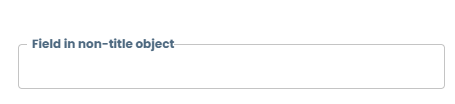
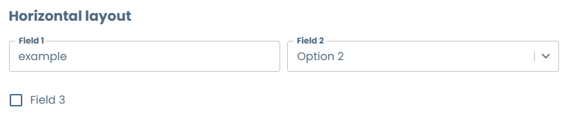
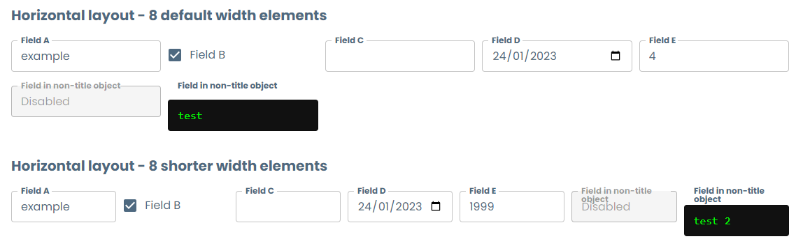
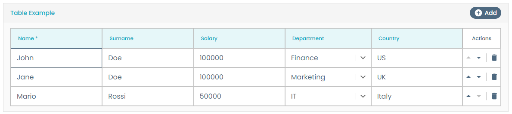
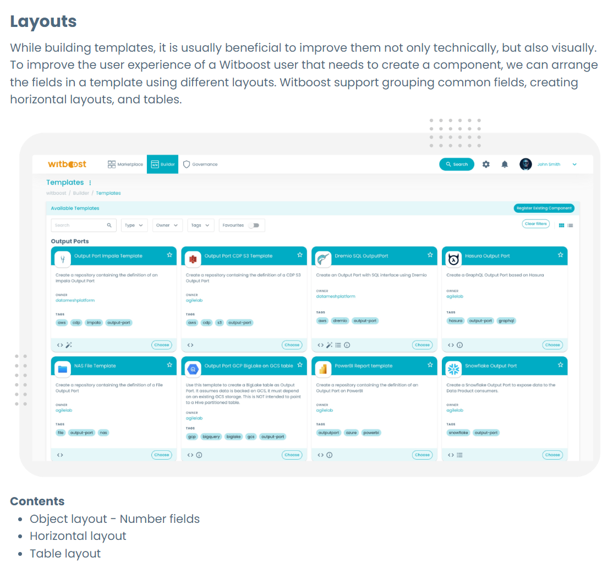

# Form Layout

While building templates, it is usually beneficial to improve them not only technically, but also visually. To improve the user experience of a Witboost user that needs to create a component, we can arrange the fields in a template using different layouts. Witboost support grouping common fields, creating horizontal layouts, and tables.

All examples shown here are taken from the accompanying [`layouts.yaml`](layouts.yaml) template file, which you can see live by following the steps explained [here](../README.md#usage).

## Object layout

As already explained in the [Basic Fields](../BasicFields/basic_fields.md#object-fields) example, we can group fields by creating nested objects in the template steps. This allows us to set a title and a description.

```yaml
numberFields:
  title: Number fields
  type: object
  description: Number fields are a way to enforce an input to accept only integer values 
  required:
    - numberField
  properties:
    numberField:
      title: Integer field
      type: number
    constrainedNumberField:
      title: Number field with constraint 0 <= x <= 10
      type: number
      minimum: 0
      maximum: 10
```


If you don't need the title nor description shown on the form you can hide it by setting `ui:options.displayTitle` to false, like so:

```yaml
noTitleGroup:
  type: object
  ui:options:
    displayTitle: false
  properties:
    name:
      title: Field in non-title object
      type: string
```



### Horizontal Layout

If you want to display different fields inside an object horizontally instead of vertically, you can change the orientation of the object by adding the field `ui:ObjectFieldTemplate: HorizontalTemplate`. By default, it will set two fields per row horizontally and overflowing to the next row:

```yaml
horizontalLayout:
  title: Horizontal layout
  type: object
  ui:ObjectFieldTemplate: HorizontalTemplate
  properties:
    fieldOne:
      title: Field 1
      type: string
    fieldTwo:
      title: Field 2
      type: string
      enum:
        - Option 1
        - Option 2
    fieldThree:
      title: Field 3
      type: boolean
```



You can configure the maximum elements per row and the minimum width of each field if you need so.

```yaml
horizontalLayoutOptionsMinElementWidth:
  title: Horizontal layout - 8 shorter width elements
  type: object
  ui:ObjectFieldTemplate: HorizontalTemplate
  ui:options:
    elementsPerRow: 8
    # minElementWidth: 150 -- See image comparison
  properties:
    fieldA:
      title: Field A
      type: string
    fieldB:
      title: Field B
      type: boolean
    fieldC:
      title: Field C
      type: string
    fieldD:
      title: Field D
      type: string
      format: date
    fieldE:
      title: Field E
      type: integer
    fieldF:
      title: Field in non-title object
      type: string
      default: Disabled
      ui:disabled: true
    fieldG:
      title: Field in non-title object
      type: string
      ui:style:
        marginTop: 20px
        background: "#111"
        color: "#0f0"
        font-family: Consolas
```



## Table Layout

You can create tables on your templates by creating an array on objects and setting the `ui:ArrayFieldTemplate: ArrayTableTemplate` property on the array field, and setting `ui:ObjectFieldTemplate: TableRowTemplate` on the child field. Witboost will create a table where each field of the inner object will be rendered as a column, offering the possibility to add, remove and reorder rows.

```yaml
tableExample:
  title: Table Example
  type: array
  ui:ArrayFieldTemplate: ArrayTableTemplate
  ui:options:
    maxDescriptionRows: 2
  default: []
  items:
    type: object
    ui:ObjectFieldTemplate: TableRowTemplate
    required:
      - name
      - dataType
    properties:
      name:
        title: Name
        type: string
      surname:
        title: Surname
        type: string
      salary:
        title: Salary
        type: number
      department:
        title: Department
        type: string
        enum:
          - Finance
          - Marketing
          - IT
          - Sales
      country:
        type: string
        title: Country

```



Check out how we use this layout to define [Table Schema layouts](../TableSchemaLayout/table_schema_layout.md) for specifying the shape and metadata of a table storing data.


## Markdown descriptions

The description field of the form steps and object fields support Markdown syntax to enrich the form visuals. This includes titles and subtitles, tables, images, and more.

```yaml
    - title: Form Layouts
      description: |-
        # Layouts

        While building templates, it is usually beneficial to improve them not only technically, but also visually. To improve the user experience of a Witboost user that needs to create a component, we can arrange the fields in a template using different layouts. Witboost support grouping common fields, creating horizontal layouts, and tables.

        

        **Contents**
        - Object layout - Number fields
        - Horizontal layout
        - Table layout
```



### Image embedding

The easiest way to include images on the form is by adding the link to a public URL hosting the image. However, on some cases this is not possible, either because the image is not publicly hosted or is only available as part of the template. To overcome these, there are a couple of workarounds.

#### Techdocs hosting

Each template has the ability to host documentation by using the Techdocs plugin of Backstage (see more info [here](../../guidelines.md#documentation)). We can leverage that Techdocs hosts the template documentation to store the image as part of it and then internally reference the directory used by the plugin to store these files. The requirements for this to work are:

- The template is configured to use Techdocs. This is done by adding the following annotation in the `template.yaml` metadata object:

    ```yaml
    apiVersion: scaffolder.backstage.io/v1beta3
    kind: Template
    metadata:
      name: template-name.1
      annotations:
        backstage.io/techdocs-ref: dir:.
    ...
    ```

- The image is included in the `docs/` folder of the template repository. It will be visible only after the documentation has been rendered at least once, so after registering the template it would be necessary to open the documentation by clicking on the Documentation icon  on the template card.

By doing so you can refer to the image by using the following path:

```yaml
spec:
  parameters:
    - title: Component metadata
      description: |-
        This is an image
        
        
```

Where `<template metadata.name>` is the value in the `metadata.name` field of the `template.yaml` file, and `<image_path_in_docs>` the path to the image relative to the `docs/` folder.

#### Base64 embedding

Markdown natively supports embedding images using Base64. This is useful for cases when we don't want to host the image in a remote URL or depend on the Techdocs rendering to query the images stored in the documentation. The syntax for this is:

```yaml
spec:
  parameters:
    - title: Component metadata
      description: |-
        This is an image
        
        
```

To facilitate the generation of these image tags, we provide a [Bash script](image_embedder.sh) to automatically generate these Base64 Markdown tags during the creation of a template. It takes a list of files containing empty tags whose alt-text stores the path to the image file, and it generates the content automatically. Thus, it takes files like:

`template.yaml`:
```yaml
...
spec:
  parameters:
    - title: Component metadata
      description: |-
        This is an image
        
        
...
```

and by executing

```bash
image_embedder.sh template.yaml
```

it generates all Base64 tags present on the document. For example, the above template converts the `img/image.png` file into Base64 and replaces in-place the tag, creating the following output:

`template.yaml`:
```yaml
...
spec:
  parameters:
    - title: Component metadata
      description: |-
        This is an image
        
        
...
```

Since Base64 encoded images can still be large, we recommend leveraging the [YAML Substitution feature](../../templating_solutions.md#dividing-the-template-into-files-yaml-substitution) to separate the template into different files, so that the main `template.yaml` remains clean and readable.

`template.yaml`:
```yaml
spec: 
  parameters:
    - $yaml: ./header.yaml
```

`header.yaml`:
```yaml
title: Component metadata
description: |-
  This is an image

  
```
