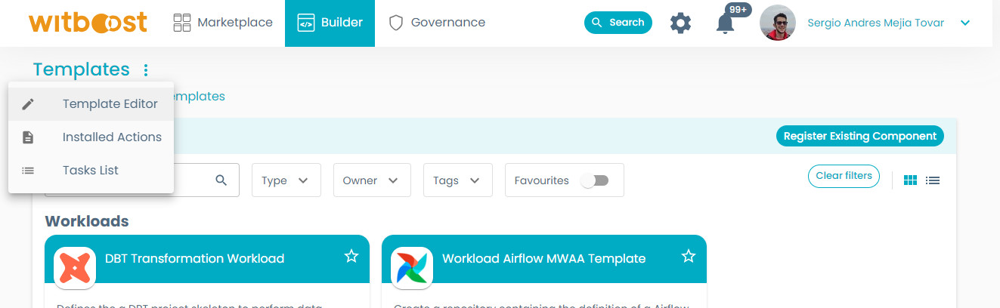
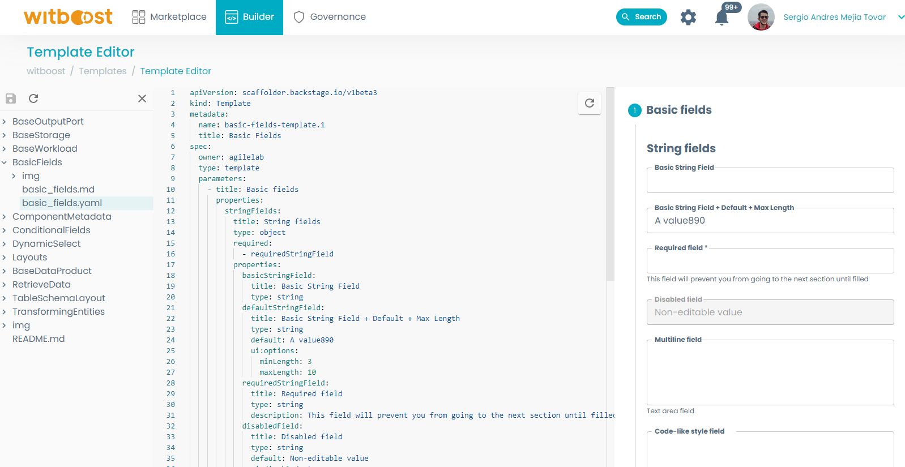

# Example snippets

The Templates Gallery provides a set of examples of component templates, access request templates and template sections grouped by functionality that you can take and customize for your own templates. 

- [Overview](#overview)
- [Usage](#usage)
- [Nunjucks](#nunjucks)

## Overview

We provide several different sections of examples, going from the explanation of the templates' [Basic Fields](BasicFields/basic_fields.md), to a scaffold for [Data Product](BaseDataProduct/base_data_product.md), [Storage](BaseStorage/base_storage.md), [Workload](BaseWorkload/base_workload.md) and [Output Port](BaseOutputPort/StreamlinedExperience/base_streamlined_experience.md) templates that you can further expand based on your environment and technology requirements.

This Templates Gallery examples are meant to be a more hands-on and code-ready experience than the Witboost documentation on the customization of templates, but the latter still acts as a valuable comprehensive resource on how to configure each type of field. 

- [**Basic Fields**](BasicFields/basic_fields.md): Learn about the different kinds of primitive (string, numbers, dates, etc.) fields you can create and how to configure them to allow for input validation, styling, and more.
- [**Layouts**](Layouts/layouts.md): Learn how to organize your template to offer a better user experience. Set up tables, row layouts, etc. to take your forms to the next level.
- [**Conditional Fields**](ConditionalFields/conditional_fields.md): Learn how to configure your template to offer different sets of fields depending on the choices and inputs from the user, allowing for more rich and complex templates.
- [**Table Schema Layout**](TableSchemaLayout/table_schema_layout.md): Data often revolves around tables, and defining its schema is vital for ensuring operability and quality. Learn how to define a table layout compliant with the OpenMetadata table schema that you can use when defining tables.
- [**Retrieve Data**](RetrieveData/retrieve_data.md): Learn how to set up fields to retrieve data from other sources and inject them into your form. This section explains how to retrieve information from the form itself or from the Witboost catalog entities.
- [**Dynamic Select**](DynamicSelect/dynamic_select.md): Tightly related to Retrieve Data, learn how to retrieve information from other sources to configure the choices offered to the user, either from the form itself, from the Witboost catalog or from external sources; improving the component creation experience and guaranteeing interoperability of Witboost entities. This section explains how to query the Witboost catalog to retrieve different kinds of entities you will need when creating a new one.
- [**Transforming Entities**](TransformingEntities/transforming_entities.md): Learn how to transform the shape of the data created or retrieved on your form, to suit the requirements of the entity or action your template will create. 
- [**Component Metadata**](ComponentMetadata/component_metadata.md): Learn how to define the common section of any component template, where we define the necessary metadata fields to identify an entity on Witboost.
- [**Base Data Product**](BaseDataProduct/base_data_product.md): We offer a base example for a Data Product, the system entity on a Data Mesh environment.
- [**Base Storage**](BaseStorage/base_storage.md): We offer a base example for a Storage component, responsible for creating the internal systems the data product needs to handle its data on a Data Mesh environment.
- [**Base Workload**](BaseWorkload/base_workload.md): We offer a base example for a Workload component, responsible for the processes to extract, load and/or transform the data used by the data product on a Data Mesh environment.
- [**Base Output Port**](BaseOutputPort/StreamlinedExperience/base_streamlined_experience.md): We offer a base example for an Output Port component, responsible for exposing the data of the data product on a Data Mesh environment, along with its metadata, data contracts and more.

## Usage

The examples we offer on this repository can be seen live on Witboost using the Template Editor. To test it follow these steps:

1. Clone this repository onto your local machine
2. Go to the Witboost UI and open the Template Editor, which is located on Builder > Templates menu, clicking on the context menu located to the right side of the title. 

    

3. Select "Load Template Directory" choosing the `examples/` folder or one of the specific example folders 

From this page, you can see a live rendering of the template, edit it and see the changes in real-time, and performing dry runs on complete templates (like the Base scaffolds).

Currently, the Template Editor has some limitations that you should be aware of:

- There is no way to reset the form context, so you will need to refresh and open the template again if you want to reset it.
- Since the form context is automatically updated as you perform modifications, some behaviours you expect to work might not correctly work. This is especially noticeable when working with pickers having dependencies on other fields of the same form. You can solve it by refreshing the page and trying again. If this doesn't solve the issue, you may have misconfigured one of the pickers! Check this Gallery examples and the Witboost documentation to troubleshoot your templates.
- If you want to perform a dry-run of a specific template, you must have the corresponding yaml file opened. Having another file opened will result in an error.

## Nunjucks

[Nunjucks](https://mozilla.github.io/nunjucks/) is a templating language for JavaScript that is used by the templates to take the inputs provided by the user and use them to create the new component's repository and metadata.

Before diving into template development, it's a good idea to go through the [documentation](https://mozilla.github.io/nunjucks/templating.html). It's extensive and well done.

Along with the functions and features described there, some useful features of Nunjucks that really help in developing templates that you should be familiar with are:

- The [`set block`](https://mozilla.github.io/nunjucks/templating.html#set) allows you to reuse expressions. You can place them at the top of your file, and use them later in the templating as any other value.
- The [`macro block`](https://mozilla.github.io/nunjucks/templating.html#macro) allows you to define chunks of templates that can be reused (similar to macros in other programming languages).
- Nunjucks provides [ways to control whitespace](https://mozilla.github.io/nunjucks/templating.html#whitespace-control); you can use this to better indent tags and blocks without them disrupting the syntax of the produced file, and make the template more readable.