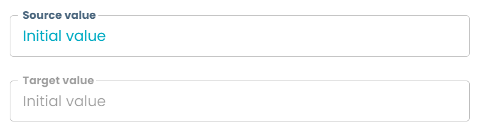
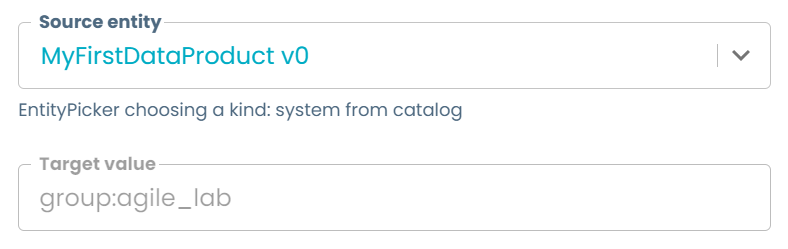
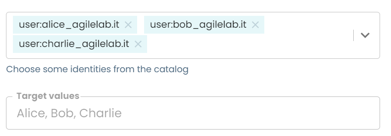

# Retrieve Data

On many cases, it is necessary to query pieces of information from existing sources, like from other entities in Witboost or from the same form, and saving them on the form context to be able to fill the new catalog-info with said information. There are several ways to retrieve information, but it is possible to summarize them in two strategies:

- From a defined object or entity, extract a value from it 
- Retrieve a list of objects or entities from which the user can select the desired one.

This example will focus on the first strategy. For understanding how to retrieve information from a source in order to present the user a set of choices, see [Dynamic Select](../DynamicSelect/dynamicSelect.md).

In order to retrieve data from a specific known source, the **EntitySelectionPicker** is the field tailored for this purpose, allowing to choose a reference to a source of information (either from the current form or from an entity on the Witboost catalog, the latter with help of other pickers like the EntityPicker), and extract information from it.

This guide explains how to retrieve values that are unique and don't need further input from the user to "choose" or refine the outcome value, including retrieving objects or arrays which are considered as single pieces of information and are not manipulated by the user, but rather only retrieving it from a source (and potentially mapping it to a new schema, see [Transforming Entities](../TransformingEntities/transformingEntities.md)).

Retrieving data on forms is very useful as it allows our forms to do things like:

- Retrieve metadata from other entities to align them, like setting the data product owner, development groups or other information from the data product to align all components to the root data product (see [Component Metadata](../BaseComponents/ComponentMetadata/componentMetadata.md))
- Read technical information from a storage area that an Output Ports depends on (or, more abstractly, a component that reads information from another component)
- Schema inheritance (see [Base Output Port - Streamlined experience](../BaseComponents/BaseOutputPort/StreamlinedExperience/streamlinedExperience.md#data-contract-schema))
- and much more...

All examples shown here are taken from the accompanying [`retrieve_data.yaml`](retrieve_data.yaml) template file, which you can see live by following the steps explained [here](../README.md#usage).

## Local (form) source

The simplest way of information retrieval is to pick a value from another field of the same form. In most of the cases, this will be redundant, as having a copy of a value in the same form means data is duplicated among fields. Nevertheless, Witboost is capable of doing so. The basic example on how to use an EntitySelectionPicker with a form field as source is shown below.

```yaml
sourceValue:
  ui:options:
    displayTitle: false
  type: object
  properties:
    source:
      type: string
      title: Source value
targetValue:
  title: Target value
  type: string
  ui:field: EntitySelectionPicker
  ui:fieldName: sourceValue
  ui:property: source
```



In this example, `targetValue` is an EntitySelectionPicker which reads the information stored in `sourceValue.source`. The source object is set using the `ui:fieldName` and it always refers to a field in the current form, whereas the piece of data to be retrieved is set using the `ui:property` field, which defines a path to the value to be retrieved. This path can include dot-notation and array indexing, so `ui:property: array[0].value` would be a valid syntax and would retrieve the `value` attribute from the first element of the `array` list.

The key aspect to make local form sourcing work is that the field whose value we want to retrieve (in this case, `source`) must be wrapped inside an object so that it acts as the source object, and `source` as a field of said source.

By default, selected values cannot be edited by the user, but there are some cases where it might be useful to do so, like setting the initial value of a field equal to another and then allowing the user to override or refine it. By setting `ui:options.allowArbitraryValues` to `true`, the field will be enabled, and it will update itself whenever the source value updates. If the field is edited by the user, it will stop updating itself, keeping the user custom value.

```yaml
sourceValue:
  ui:options:
    displayTitle: false
  type: object
  properties:
    source:
      type: string
      title: Source value
editableTargetValue:
  title: Target value
  type: string
  ui:field: EntitySelectionPicker
  ui:fieldName: sourceValue
  ui:property: source
  ui:options:
    allowArbitraryValues: true
```

:::info

You can only enable custom edition when the field is of `type: string`.

:::

## Catalog source

One of the fundamentals of any template is the ability to link the newly created entity to others already existing on the catalog. For instance, when creating a Data Product the user must choose the domain it belongs to, so the template must have the capability of showing the existing domains in the platform and allowing the user to choose the appropriate one. Or when creating a component, it should know the Data Product it belongs to and extract relevant information from it that the component might need to save on its own metadata. 

The **EntityPicker** covers the role of querying the catalog for a set of entities to show to the user and show them to the user (for more information see [Dynamic Select](../DynamicSelect/dynamicSelect.md)). Then, the **EntitySelectionPicker** can query the entity referenced by the EntityPicker and retrieve the necessary information.

### Primitive field

The base case is shown below, where an EntityPicker is configured to query all the entities with `kind: system` from the catalog, and an EntitySelectionPicker is configured to point at that EntityPicker and retrieve a specific field from it. As each entity type should have a standard, uniform schema, we can safely reference the value using a static path (which, in the case above is defined on the `ui:property` property).

```yaml
sourceValue:
  title: Source entity
  type: string
  description: "EntityPicker choosing a kind: system from catalog"
  ui:field: EntityPicker
  ui:options:
    allowedKinds:
      - System
targetValue:
  title: Target value
  type: string
  ui:field: EntitySelectionPicker
  ui:fieldName: sourceValue
  ui:property: spec.owner
  ui:options:
    allowArbitraryValues: false
```



The structure shown in this example also works with other fields that query entities on the catalog, like the **EntityRelationsPicker** or the **ReadsFromPicker**.

If you simply need to retrieve information from an entity to store it on the catalog-info, but you don't need to show it to the user, instead of using the combination EntityPicker plus EntitySelectionPicker, just use the EntityPicker with the property `ui:options.storeRawEntity` set to `true` and use nunjucks! This property stores the catalog-info of the retrieved entity on the form context and by doing so, it is available on the `parameters` object on the template action. An example below:

```yaml
spec:
  parameters:
    - title: Step one
      properties:
        # other fields goes here...
        sourceDescriptor:
          type: object # must be of `type: object`
          title: Source Descriptor
          description: A source descriptor to be stored in the formContext
          ui:field: EntityPicker
          ui:options:
            # other options
            storeRawEntity: true # this is the key property that does the magic
  # ...
  steps:
    - id: template
      name: Fetch Skeleton + Template
      action: fetch:template
      input:
        # other input fields of the fetch:template scaffolder action...
        values:
          # other values we want to pass...
          developmentGroup: '{{ parameters.sourceDescriptor.spec.mesh.devGroup }}' 
```

Use cases with other pickers:

- When you need to select a component from the same data product and grab a value from it, use the **EntityRelationsPicker**. You can see an example on the [Base Output Port - Streamlined experience](../BaseComponents/BaseOutputPort/StreamlinedExperience/streamlinedExperience.md#data-contract-schema) where we show how to retrieve the table schema from another component and save it on the new one.
- When building lineage, and you need to pick information from a single component external to the data product, use a **ReadsFromPicker**.
- When retrieving users belonging to a certain group or domain, use an **EntityRelationsPicker**.

For more information and examples on how to configure these and other pickers, see [Dynamic Select](../DynamicSelect/dynamicSelect.md).

### Array field

It is also possible to query arrays of objects where its items share the same schema, and retrieve a value from each of the items, effectively performing a `map` operation on the array. We show below an example using an IdentitiesPicker, which retrieves an array of user entities, and extracts from each of its items the specified property.

```yaml
identitiesSourceValue:
  title: Source entity
  type: array
  description: "Choose some identities from the catalog"
  ui:field: IdentitiesPicker
  ui:options:
    maxIdentities: 5
    allowedKinds:
      - User
    showOnlyUserMemberGroups: true
multipleTargetValue:
  title: Target values
  type: array
  ui:field: EntitySelectionPicker
  ui:fieldName: identitiesSourceValue
  ui:property: spec.profile.displayName
  ui:options:
    allowArbitraryValues: false
```



Here, by setting the `type` of the EntitySelectionPicker field to `array` and pointing the `ui:fieldName` to an `array` field, we instruct the form to map the input array by selection the selected `ui:property`. In this case, the field will be storing an array containing the display name of the selected users whose values we can see rendered on the field.

To discover which other mapping operations the EntitySelectionPicker can do on retrieved arrays and objects, see [Transforming Entities](../TransformingEntities/transformingEntities.md).