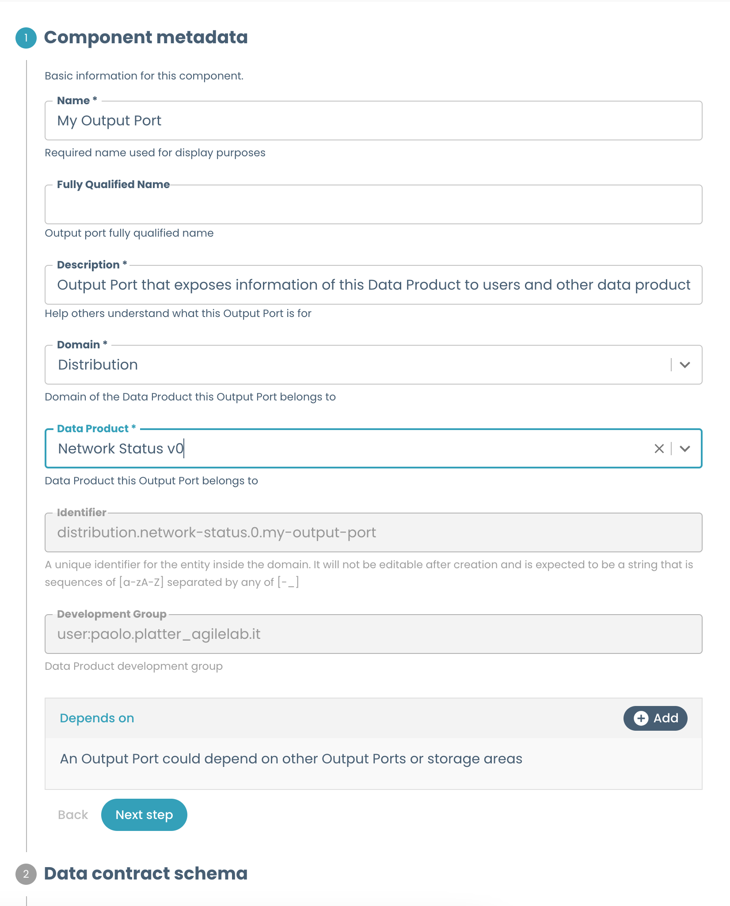

# Templates Overview

This documentation provides a comprehensive guide to building templates for Witboost. Templates are a core part of the user experience when using Witboost, and as such for the Platform Team it is crucial to develop easy-to-use, intuitive, reusable templates.

This section includes reference documentation on Witboost templates and its customization, guidelines on how to design the wizard and other parts of a template, best practices to follow when working on them, and examples of reusable snippets that can be incorporated in templates.

### What's a Template?

A Template is a tool that helps create components inside Witboost. Templates help establish a standard across the organization. This standard leads to easier understanding, management and maintenance of components. Templates provide a predefined structure so that developers don't have to start from scratch each time, which leads to faster development and allows them to focus on other aspects, such as testing and business logic.

A template is composed of two main parts:

- The wizard, created from the `template.yaml`
- The skeleton, defined on the `skeleton/` folder

The wizard is what the user is presented with when they choose a template to define a new component in Witboost. It guides the user into configuring the new component and providing metadata and other information about it.



The skeleton contains a templated version of what will become the contents of teh repository of the new template. It can be as simple as just the metadata files required by Witboost, or as complex as an entire codebase for complex workloads, with documentation on the component that is being defined.

```
template.yaml
mkdocs.yml
docs/
├──── index.md
skeleton/
├──────── README.md
├──────── catalog-info.yaml
├──────── mkdocs.yml
├──────── .gitlab-ci.yaml   <--- CI/CD pipeline which will be executed by Use case templates
├──────── docs/
│         └──── index.md
├──────── environments/
│         ├──────────── dev/
│         │             └─── configurations.yaml
│         ├──────────── prod/
│         │             └──── configurations.yaml
│         └──────────── # any other env config goes here
└──────── # any other skeleton files here
```

If you're looking to develop your first template using the information in this repository, we suggest starting from the [guidelines](guidelines.md).

For more information on templates, also check out the [user documentation](https://docs.witboost.com/docs/p1_user/p6_advanced/p6_1_templates/#getting-started).