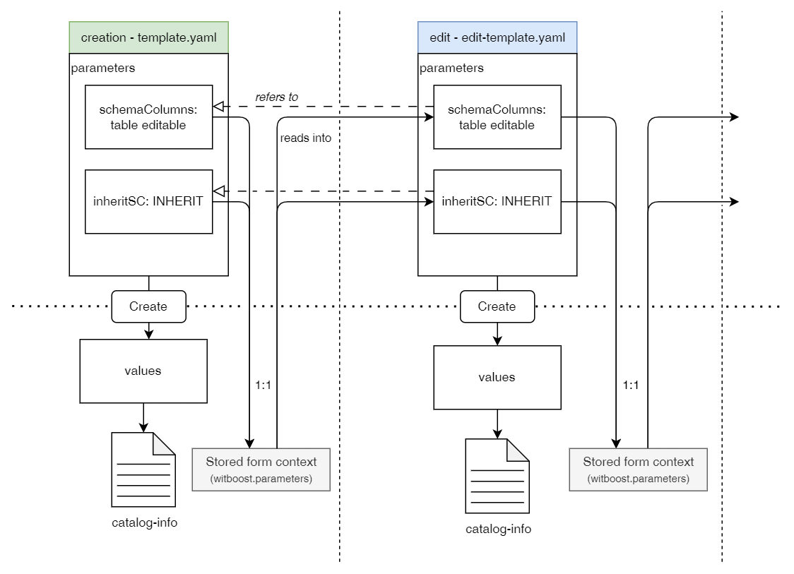
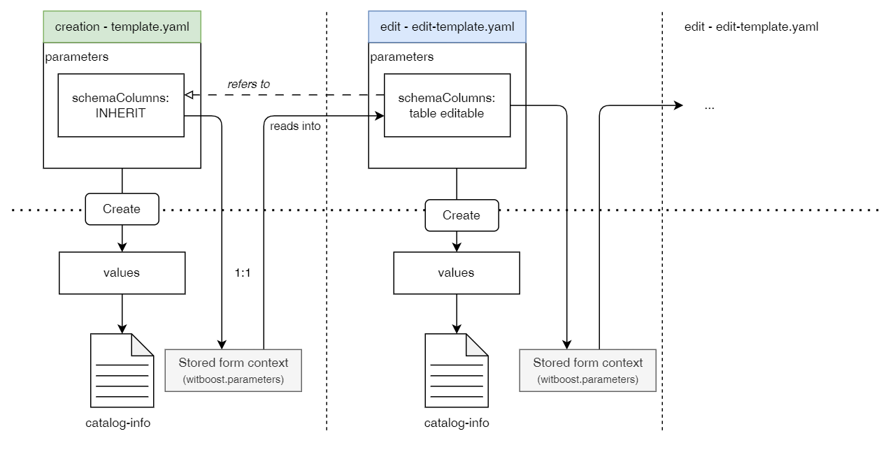

# Templating solutions

## Same field, different visual renders

When creating a template, we might require that a field is shown with a different layout depending on the input of the user (for example, a [conditional field](examples/ConditionalFields/conditional_fields.md) that allows the user to either pick a value from an external source, or typing it manually). The problem lies in the limitation Witboost templates have where one field (identified by its key) can only have one "winning" definition, so if the same field is defined in two different places, one will override the properties and visual rendering of the others. As we will see, there are several solutions to this problem, each one with their own advantages and disadvantages.

- **Two fields that coalesce into one on templating step**

The first solution we propose is the most straight-forward but that comes with a set of disadvantages. It is possible to simply define two different fields with different keys, and when defining the nunjucks template, we choose one of them based on a condition. This works: Even if there are technically two values, visually for the user the same field will be seen in two different ways, and when creating the entity the catalog-info file will store the correct value. However, there are limitations to this approach, which, depending on your use case, won't make of this a viable choice:

1. **The fields are duplicated, cluttering the yaml:** Since we're duplicating fields, the `template.yaml` becomes longer, as well as the catalog-info as we need to write the condition logic for the duplicated fields.   
2. **The values are not linked in any way:** As these are two different fields, the values are being stored in two different variables and as such, if one changes, the other will stay with the same value (or the default value, if it hasn't been touched by the user). In many cases this wouldn't be an issue at creation time, as we are then choosing one of the values to store. However, this leads to another issue:
3. **Editing the entity with the other field type becomes impossible:** If the component has an Edit Template linked to it, where we want to allow the user to edit this value, we will need to either choose one of the two fields (as we need to set the same key in order for the Edit Template to grab the value from the previous form context) to show to the user, or give again the two options to the user. However, since the values **are not linked in any way**, only the field where the user input initially the value will have it stored.
    
    In order to understand this behaviour, let's look at a diagram:

    

    Assume we have a field to define the table schema of a component. We want to give the option to the user to inherit it from an existing component (`inheritSC`) or to write it manually (`schemaColumns`), and then when creating the catalog-info file we set the correct condition for it to be saved correctly based on the choice of the user (see the [Output Port Streamlined Experience](examples/BaseOutputPort/StreamlinedExperience/base_streamlined_experience.md) example). The form context will be saved along with the catalog-info in order to allow the component to be editable. Different to the catalog-info, this form context will store both values with the appropriate key, each referring to one of the fields. 

    If we define a basic Edit Template which mirrors the creation Template, we run into the error seen on the diagram. Each of the fields will load from the stored form context the values, which in practice means that each field will show what the user inputted on the form, not what the value is on the catalog-info. Thus, if the user chose to fill the `inheritSC` at creation time, but then want to manually edit said schema, it won't be able to do so, as `inheritSC` is defined as a picker to inherit said schema. The same problem verifies if the user inputted the schema manually.

You can use this solution if your template doesn't come with an Edit template to use with the Editor Wizard (although why would you block your users for editing their components?)

- **One field at creation time, one at edit time**

Depending on the use case, the solution to this problem might lie on the usage of the Edit Template. As stated above, the field cannot have more than one definition on each template, but this problem is not verified across templates, so a field can be defined on one way on the creation template, and on another way on the Edit Template. This solution purposefully limits the choices for the user, as it doesn't allow to make a choice, but it allows us to do other interesting things. 

If we retake the above example of the table schema definition, we can create the templates such that the user is forced to inherit an existing schema (or leave it empty), and to allow for its edition on the Edit Template. That way we streamline the creation process and we shift the load onto the editing process, which can be done at a later point in time and as many times as needed. The diagram would look like this:



This way, the field is always the same, so the retrieval from the form context works without issues, and we are able to define the value of the field in two different ways. 

The disadvantages of this method are the following:

1. **Only one choice at each step:** This solution doesn't allow the creation of a template that gives the choice to the user to insert the values in two different ways, so it might not be suitable in some use cases.
2. **It lengthens the creation of a fully deployment-ready component:** Depending on the definition of the creation template and the limitation of choices from the user, the created component might not be deployment-ready at first but must be iterated continuously in order to have all of its fields filled. However, as stated on the best practices guidelines, this is seldom an issue, as we recommend the component creation template to be as straightforward as possible and rely on Edit Templates to complete the component technical details.

We leverage this last approach on the [Output Port Streamlined Experience](examples/BaseOutputPort/StreamlinedExperience/base_streamlined_experience.md) example.

## Dividing the template into files - YAML Substitution

The template format supports substitutions using $text, $json, and $yaml.

Placeholders like `$yaml: ./header.yaml` are substituted by the content of the referenced file. Files can be referenced from any configured integration similar to locations by passing an absolute URL. It's also possible to reference relative files like `./referenced.yaml` from the same location.

This allows us to divide the template definition into different files where the template is complex and/or long. While we discourage the creation of long templates (see [Guidelines](guidelines.md)), sometimes the file itself becomes big and difficult to manage, so we can use YAML substitution to solve this by dividing the file into smaller ones.

Furthermore, it allows whenever possible to reuse snippets of template without needing to rewrite them (e.g. [Table Schema layout](examples/TableSchemaLayout/table_schema_layout.md)).

Let's see an example. Imagine we have the following structure:

```
.
├── docs/
├── skeleton/
├── mkdocs.yaml
├── template.yaml
├── data_contract_schema.yaml
└── README.md   
```

Where we have defined the table schema for a data contract on a separate file `data_contract_schema.yaml`, containing:

`data_contract_schema.yaml`:
```yaml
schemaDefinition:
 title: Define your table schema
 type: object
 properties:
   schemaColumns:
     title: Column Definitions
     type: array
     ui:ArrayFieldTemplate: ArrayTableTemplate
     items:
       type: object
       ui:ObjectFieldTemplate: TableRowTemplate
       required:
         - name
         - dataType
       properties:
         name:
           type: string
           title: Name
         description:
           type: string
           title: Description
...
```

To embed it as part of a step on our `template.yaml` we can do:

`template.yaml`:
```yaml
spec: 
  parameters:
    - title: Data contract schema
      required:
         - schemaDefinition
      properties:
        $yaml: ./data_contract_schema.yaml
```

The processing of the file will be done when Registering the template on Witboost, which will store the exploded `template.yaml`. However, the files on the repository remain separated and the template on Witboost gets updated every time it is refreshed. 